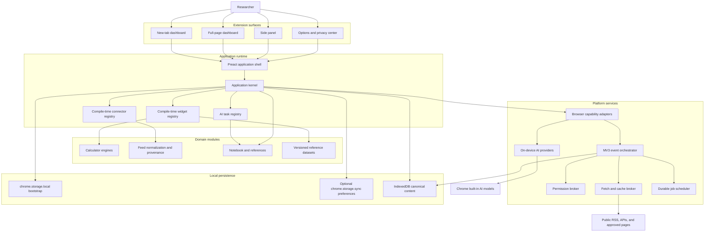
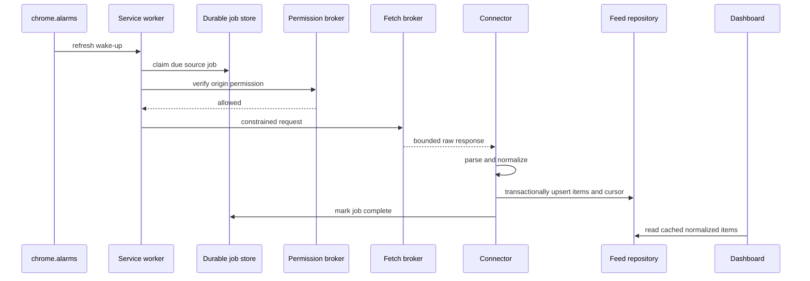

# BenchTab Reference Architecture

Status: Proposed baseline for implementation  
Last updated: 2026-08-24  
Primary platform: Google Chrome, Manifest V3  
Baseline browser: Chrome 114+  
Technical artifacts and identifiers: English

## 1. Purpose

BenchTab is a local-first research workbench for experimental materials, thin-film, sensor, vacuum, and measurement workflows. It combines deterministic scientific calculators, reference datasets, source-backed literature and announcement feeds, optional on-device AI, and a reference-aware notebook.

This architecture is designed to support:

- Adding new calculators, reference datasets, feed connectors, workflow tools, and AI tasks without changing the application shell.
- Adopting future Chrome APIs behind stable internal interfaces.
- Surviving Manifest V3 service-worker termination without losing or corrupting work.
- Complying with Chrome Web Store minimum-permission, single-purpose, privacy, and remote-hosted-code policies.
- Operating without a BenchTab account, OAuth, developer-operated user-data backend, or telemetry.
- Keeping numeric computation deterministic and isolated from generative AI.

## 2. Product boundary

The Chrome Web Store single-purpose statement is:

> A local-first browser workbench for following, calculating, and recording experimental research.

Every shipped capability must directly support this statement. Generic email, calendar, chat, advertising, broad web search, or unrelated productivity features are outside the product boundary.

### 2.1 In scope

- Deterministic laboratory calculators with explicit assumptions and references.
- Versioned offline scientific reference data.
- Public RSS, Atom, JSON API, and narrowly scoped public-page connectors.
- Source-preserving translation, summarization, tagging, relevance ranking, and digests using browser-provided on-device AI.
- Local Markdown notes linked to papers, announcements, calculations, samples, and dates.
- New-tab, full-page dashboard, options, and side-panel surfaces.
- User-controlled import, export, backup, and deletion.

### 2.2 Out of scope

- Remote executable plugins or widgets.
- Cloud AI fallback.
- AI-generated numeric results or AI-selected scientific constants.
- Capturing browsing history or arbitrary page content.
- Content-script injection in v1.
- Credentials, cookies, or authenticated-site scraping.
- Full-text article republication.
- Clinical, diagnostic, regulated, or safety-critical decision support.

## 3. Architectural principles

1. **Capabilities, not Chrome APIs, are the dependency boundary.** Feature modules never call `chrome.*`, `fetch`, IndexedDB, or built-in AI globals directly.
2. **Modules are compiled, not downloaded.** All executable behavior is present in the reviewed extension package.
3. **External content is untrusted data.** RSS, JSON, HTML, abstracts, and imported files are parsed, validated, bounded, and never executed.
4. **The service worker is disposable.** It may terminate between any two awaited operations. Durable state is the source of truth.
5. **Storage classes are explicit.** Preferences, private content, cache, secrets, and derived AI artifacts have different stores and retention rules.
6. **Citations are data, not generated prose.** AI may select bundled source IDs but may not create URLs, DOIs, authors, or publication metadata.
7. **Numeric and generative paths do not meet.** Calculator engines are pure functions. AI cannot call or alter them.
8. **Permissions follow user intent.** A host permission is requested only when the user enables the source that requires it.
9. **Feature detection beats browser detection.** New Chrome features are adopted through capability providers and runtime checks.
10. **Data evolution is part of every module contract.** All persisted module data is versioned and migratable.

## 4. System overview



## 5. Distribution surfaces

The repository produces two manifest targets from the same codebase. They are alternative editions; users are not expected to install both.

### 5.1 `newtab` edition — primary

- Overrides `chrome://newtab`.
- Includes the full dashboard and side panel.
- The toolbar action opens the same research workbench, not unrelated functionality.
- Intended for users who explicitly choose BenchTab as their new-tab experience.

### 5.2 `dashboard` edition — optional validation channel

- Does not override the new-tab page.
- Opens the full dashboard from the toolbar action and provides the side panel.
- Lets hesitant users validate the tools without surrendering their new-tab page.
- Uses a separate Web Store item and extension ID if published.

The two editions share source code and data schemas but do not depend on cross-extension messaging. Import/export is the supported transfer mechanism between editions.

### 5.3 Baseline and progressive capabilities

Chrome 114 is the baseline because the side-panel surface is part of the core product. Features introduced later must remain optional:

| Capability | Expected platform | Behavior when absent |
|---|---:|---|
| New-tab override | Manifest V3 baseline | Not present in `dashboard` edition |
| Side Panel API | Chrome 114+ | Full-page dashboard remains available |
| Offscreen API | Chrome 109+ | Packaged non-DOM parsers are preferred; optional DOM tasks are disabled |
| Translator/Language Detector | Chrome 138+ desktop | Original language remains available |
| Summarizer API | Chrome 138+ supported devices | Source description remains available |
| Prompt API for extensions | Chrome 138+ supported devices | Deterministic ranking and manual digest remain available |
| Newer AI parameters or APIs | Feature-detected | Provider uses its older supported behavior |

No domain module checks Chrome version numbers. It asks the capability registry for support.

## 6. Repository and package structure

```text
apps/
  extension/
    src/
      entries/
        newtab/
        dashboard/
        sidepanel/
        options/
        service-worker/
      manifests/
        base.ts
        newtab.ts
        dashboard.ts

packages/
  contracts/                 # Stable public types used by all modules
  kernel/                    # Dependency injection, registries, lifecycle
  browser-platform/          # All chrome.* and browser feature adapters
  persistence/               # Repositories, transactions, migrations, export
  scheduler/                 # Durable jobs and alarm orchestration
  network/                   # Permission, fetch, cache, rate-limit brokers
  provenance/                # DOI, arXiv, URL normalization and citations
  notebook/                  # Notes, references, Markdown export
  ai/                        # AI task contracts, providers, validation
  ui-shell/                  # Grid, catalog, settings renderer, themes
  ui-components/             # Accessible shared components
  reference-data/            # Versioned, licensed offline datasets

  widgets/
    spectroscopy-converter/
    bragg-lattice/
    sheet-resistance/
    hall-measurement/
    vacuum-kinetics/
    ...

  connectors/
    rss-atom/
    arxiv/
    biorxiv/
    crossref/
    pubchem/
    journal-rss/
    ...

tools/
  build-registry/            # Generates module registries and permissions
  validate-modules/          # Contract and policy validation
  build-reference-data/      # Reproducible dataset generation
  build-validation-report/   # Public calculator comparison report

tests/
  e2e/
  fixtures/
  malicious-content/

docs/
  adr/
  validation/
  data-sources/
```

Dependency direction is inward:

```text
UI modules -> contracts -> domain services
platform adapters -> contracts
domain modules -X-> platform adapters
```

Circular dependencies between widgets, connectors, and the application shell are prohibited.

## 7. Module system

### 7.1 Compile-time registration

`tools/build-registry` scans bundled module manifests, validates them, and generates static registries. Lazy `import()` is allowed only for chunks included in the extension package.

Runtime installation of executable modules is not supported. New executable modules arrive through reviewed extension releases. Data-only source lists, themes, and reference packs may be imported if they pass a strict declarative schema and contain no formulas, scripts, selectors that change application behavior, or executable expressions.

### 7.2 Widget contract

```ts
export interface WidgetModule<Settings, State = never> {
  manifest: {
    id: string;
    version: number;
    kind: "calculator" | "reference" | "feed" | "workflow";
    titleMessageKey: string;
    descriptionMessageKey: string;
    supportedSurfaces: Array<"dashboard" | "sidepanel">;
    defaultLayout: ResponsiveWidgetLayout;
    requiredCapabilities: CapabilityRequest[];
    dataClassification: "preferences" | "private-content" | "public-cache";
  };

  settingsSchema: JsonSchema;
  settingsUiSchema?: SettingsUiSchema;
  migrateSettings: MigrationChain<Settings>;
  loadView: () => Promise<WidgetView<Settings, State>>;
}
```

Rules:

- The generic settings renderer consumes JSON Schema plus a small UI-hints schema.
- A capability that can be understood, hidden, reordered, and used independently is registered as its own dashboard module; composite packs may exist only as compatibility compositions.
- Related workflow cards share one injected state provider instead of nesting independent tools inside a visually oversized parent card.
- Desktop cards target four columns and a bounded visual height; long interactive content scrolls inside its module so one expanded tool cannot displace the rest of the dashboard.
- A widget cannot request raw `fetch`, `chrome.permissions`, storage handles, or AI globals.
- Widget state is addressed through namespaced repositories supplied by `WidgetContext`.
- Widget manifest capabilities are audited during the build.
- Dashboard and side-panel views may differ, but domain logic is shared.

### 7.3 Calculator contract

```ts
export interface CalculatorEngine<Input, Output> {
  id: string;
  algorithmVersion: string;
  inputSchema: JsonSchema;
  outputSchema: JsonSchema;
  calculate(input: Input, context: NumericContext): CalculationResult<Output>;
}

export interface CalculationResult<Output> {
  output: Output;
  warnings: ScientificWarning[];
  provenance: CalculationProvenance;
}
```

`CalculationProvenance` contains:

- Calculator and algorithm version.
- Normalized inputs and units.
- Constants dataset version.
- Formula/method identifiers.
- Source references and caveats.
- Timestamp and application version.

Calculator engines are pure TypeScript functions. They do not read time, locale, storage, network state, or AI state. Locale-specific parsing occurs before calculation; display formatting occurs afterward.

### 7.4 Connector contract

```ts
export interface SourceConnector<Config, Cursor, Raw> {
  descriptor: {
    id: string;
    version: number;
    sourceType: "rss" | "atom" | "json-api" | "public-html";
    allowedOrigins: OriginPattern[];
    refreshPolicy: RefreshPolicy;
    contentPolicy: ContentPolicy;
  };

  configSchema: JsonSchema;
  poll(ctx: ConnectorContext, config: Config, cursor?: Cursor): Promise<PollResult<Raw, Cursor>>;
  normalize(raw: Raw, ctx: NormalizeContext): NormalizedFeedItem[];
}
```

Connectors may only access:

- A constrained `FetchBroker` scoped to their declared origins.
- Their own source state and cursor repository.
- Provenance normalization utilities.
- Packaged parsers and schemas.

Connectors cannot access notes, calculator records, unrelated source subscriptions, or AI providers.

### 7.5 Community contribution path

Each new executable widget or connector requires:

1. A unique stable ID and module manifest.
2. Explicit capability and data-classification declarations.
3. Settings/data migrations from every previously released schema version.
4. Unit tests and, for calculators, reference/oracle validation cases.
5. Scientific references and dataset licenses.
6. Malicious-input and size-limit tests for connectors.
7. Review before inclusion in a signed release.

## 8. Application kernel and dependency injection

The application kernel constructs a per-context capability container:

```ts
export interface AppCapabilities {
  storage: StorageCapabilities;
  permissions: PermissionCapabilities;
  feeds: FeedCapabilities;
  notebook: NotebookCapabilities;
  citations: CitationCapabilities;
  ai: AiCapabilities;
  scheduler: SchedulerCapabilities;
  diagnostics: LocalDiagnosticsCapabilities;
}
```

The kernel has no Chrome-specific behavior. `browser-platform` supplies implementations for Chrome. A future Edge or other Chromium build may supply alternative implementations without changing calculators, notebook logic, connectors, or views.

All cross-context messages use versioned, JSON-serializable command schemas. Arbitrary URLs, method names, or code are never accepted through message passing.

## 9. Manifest V3 runtime model

### 9.1 Service worker responsibilities

The service worker is an event-driven orchestrator, not an application server. It performs:

- Top-level registration of `runtime`, `alarms`, `permissions`, and message listeners.
- Durable job claiming and checkpointing.
- Feed refresh orchestration.
- Verification of current host permissions and reactions to permission add/remove events.
- Cache maintenance and migration wake-ups.
- Re-creation of missing alarms on startup and relevant events.

The service worker does not own authoritative in-memory state. Global values may be used only as disposable optimizations.

### 9.2 Durable jobs

All background work is represented by an IndexedDB record:

```ts
export interface DurableJob {
  id: string;
  type: "refresh-source" | "evict-cache" | "rebuild-index" | "migrate-data";
  dedupeKey: string;
  status: "queued" | "leased" | "retry" | "done" | "failed";
  attempt: number;
  nextAttemptAt: number;
  leaseUntil?: number;
  checkpoint?: JsonValue;
  payload: JsonValue;
}
```

Job execution rules:

- Claim a short lease transactionally.
- Process one bounded step.
- Persist the checkpoint before starting the next step.
- Make every step idempotent through `dedupeKey` and stable entity IDs.
- Renew a lease only after persisted progress.
- Back off on network errors and honor `Retry-After`.
- Treat alarms as wake-up hints, not guaranteed exact timers.
- Scan overdue jobs when the service worker starts.

This design remains correct if Chrome terminates the worker between two operations.

### 9.3 DOM work

Service workers have no DOM. The default RSS/Atom path uses a packaged, non-DOM XML parser.

An offscreen document is a narrowly-scoped platform adapter used only for countdown alarm audio. It must:

- Be a static packaged document.
- Be created just in time with the narrowest supported reason.
- Accept only validated, versioned messages.
- Be closed after the bounded operation.
- Never become a hidden persistent background page.

The shipped alarm adapter uses only the packaged Web Audio oscillator and Chrome's `AUDIO_PLAYBACK` reason. Chrome closes the document after audio inactivity; it performs no network request and receives no note, feed, or research content.

## 10. Network, permissions, and source safety

### 10.1 Permission broker

Only a platform `PermissionBroker` calls `chrome.permissions`. The request method runs in the visible extension document, directly inside the user's click or keyboard activation handler, so Chrome's user-gesture requirement is preserved. The service worker may verify existing access and react to permission changes, but it does not initiate a permission prompt.

Flow for adding a network source:

1. Resolve the source configuration to exact origins.
2. Explain the source and required origin in the UI.
3. Request access synchronously from the user's enable action.
4. Store the source only after permission is granted.
5. Provide a visible permission/revocation screen.
6. Keep the rest of the product operational after denial or revocation.

The manifest contains no required host permissions. Built-in connectors contribute exact optional origins. The generic user-supplied RSS connector may require `https://*/*` in `optional_host_permissions`, but runtime requests remain origin-specific.

### 10.2 Fetch broker

All extension network traffic goes through `FetchBroker`.

It enforces:

- HTTPS by default.
- Origin allowlists and current permission checks.
- `credentials: "omit"` for public sources.
- Redirect validation; a redirect to a new origin requires permission for that origin.
- Request timeouts shorter than Chrome's service-worker fetch limit.
- Response body and item-count caps.
- Accepted content types per connector.
- Per-origin concurrency and rate limits.
- Conditional requests with ETag and Last-Modified.
- Exponential backoff, jitter, and negative caching.
- A descriptive, packaged User-Agent strategy where the API permits it.

The new-tab and side-panel views never fetch external sources directly. They render cached normalized records and ask the orchestrator to refresh in the background.

### 10.3 Parsing and rendering

- Fetched HTML is never inserted with `innerHTML`.
- Feed-provided scripts, styles, iframes, forms, images, and event handlers are discarded.
- V1 renders title, authors, date, source, identifiers, plain-text description, and links.
- Only `https:` links may be opened. `javascript:`, `data:`, `file:`, and extension URLs from feeds are rejected.
- HTML adapters ship as code with the extension. Selector or parser logic is not updated remotely.
- Public-page adapters are used only when the site terms and content format permit it.

## 11. Feed pipeline and provenance



### 11.1 Normalized feed item

```ts
export interface NormalizedFeedItem {
  id: string;
  sourceId: string;
  connectorId: string;
  canonicalUrl: string;
  title: string;
  authors: PersonName[];
  publishedAt?: string;
  updatedAt?: string;
  retrievedAt: string;
  identifiers: {
    doi?: string;
    arxiv?: string;
    pmid?: string;
  };
  sourceDescription?: PlainText;
  language?: string;
  license?: SourceLicense;
  provenance: SourceProvenance;
  contentHash: string;
}
```

Stable IDs are derived in this order:

1. Normalized DOI.
2. Domain identifier such as arXiv ID.
3. Canonical HTTPS URL.
4. Connector ID plus a hash of normalized title, authors, and date.

Duplicate records are merged without losing source provenance. The UI may show one item with several source references.

## 12. Citation architecture

References are first-class immutable records:

```ts
export interface ReferenceRecord {
  id: string;
  type: "article" | "preprint" | "announcement" | "dataset" | "web-page";
  title: string;
  authors: PersonName[];
  publisherOrInstitution?: string;
  publishedAt?: string;
  doi?: string;
  canonicalUrl: string;
  retrievedAt: string;
  sourceSnapshot: SourceSnapshot;
}
```

Rules:

- DOI and URL normalization is deterministic.
- Citation metadata comes from the connector or a citation metadata service, never from the LLM.
- Saving a feed item to the notebook creates or reuses a `ReferenceRecord` and links the note to it.
- A note keeps a minimal metadata snapshot so it remains understandable if a remote page changes.
- Full abstracts or article bodies are not copied into notes automatically.
- Markdown, BibTeX, RIS, and JSON export are generated from `ReferenceRecord`.

## 13. On-device AI architecture

### 13.1 Provider abstraction

```ts
export interface AiProvider {
  describeCapabilities(): Promise<AiCapabilityReport>;
  translate(request: TranslationRequest): Promise<TranslationArtifact>;
  summarize(request: GroundedSummaryRequest): Promise<SummaryArtifact>;
  rank(request: RelevanceRequest): Promise<RankingArtifact>;
  digest(request: DigestRequest): Promise<DigestArtifact>;
}
```

Providers:

- `ChromeTranslatorProvider`
- `ChromeSummarizerProvider`
- `ChromePromptProvider`
- `UnavailableAiProvider`

No provider silently calls a cloud service. Experimental Chrome polyfills with network fallbacks are not used in production.

### 13.2 Execution rules

- AI is invoked from a visible extension document after explicit user action.
- Model availability and download state are checked before task creation.
- The user consents before a browser-managed model or language pack is downloaded.
- Background refresh never triggers model download.
- Translation may process source text; summarization requires an abstract or source-provided description.
- A title alone may be translated but not presented as an article summary.
- AI output is labeled, editable, removable, and never replaces original metadata.
- Numeric calculator services are not exposed to AI contexts.

### 13.3 Grounding and citation enforcement

AI requests use local opaque source IDs. Structured output is constrained to IDs supplied in the request:

```ts
export interface GroundedClaim {
  text: string;
  sourceIds: string[];
}

export interface DigestArtifact {
  claims: GroundedClaim[];
  generatedAt: string;
  inputHash: string;
  promptVersion: string;
  providerId: string;
  browserVersion: string;
}
```

Post-validation rejects:

- Unknown source IDs.
- Claims without a source.
- URLs, DOIs, authors, or dates generated in free text when they are not present in the input records.
- Output that violates length, language, or schema constraints.

URLs and formatted citations are attached after validation by looking up the approved source IDs.

### 13.4 Prompt-injection boundary

Feed content is untrusted even when it comes from a reputable source. It is clearly delimited as data and cannot grant tools, invoke extension APIs, read notes, request network access, or alter the system prompt. AI tasks receive only the minimum selected fields required for that task.

### 13.5 Relevance baseline

AI relevance is a reranker, not the only ranking system. The deterministic baseline combines:

- User-selected topics and exact keywords.
- Source/category preferences.
- DOI/topic metadata.
- Recency and explicit hide/save feedback.

The Prompt provider reranks a bounded candidate set. If it is unavailable or fails evaluation, the deterministic ranking remains complete.

## 14. Notebook architecture

### 14.1 Note model

```ts
export interface NoteRecord {
  id: string;
  version: number;
  type: "free" | "literature" | "experiment" | "sample" | "calculation" | "funding";
  title: string;
  markdown: string;
  createdAt: string;
  updatedAt: string;
  tags: string[];
  referenceIds: string[];
  calculationRecordIds: string[];
  sourceItemIds: string[];
}
```

### 14.2 Storage and editing

- Notes are canonical in IndexedDB and local-only in v1.
- Autosave uses transactional revisions and debounce in the visible document.
- A short revision window protects against accidental overwrite.
- AI-generated text is inserted as an explicitly labeled block, not silently merged into the user's prose.
- Markdown rendering uses a packaged parser and sanitizer with raw HTML disabled.
- Search uses a local index that can be rebuilt from canonical records.
- Attachments are outside v1; a future `BlobStore` interface may use IndexedDB or OPFS without changing note records.

### 14.3 Backup

The first public release must include:

- Versioned JSON export of all user-owned data.
- Markdown plus BibTeX/RIS export for notes and references.
- Import preview with validation and conflict reporting.
- A one-click delete-all-local-data operation.
- Export that excludes API keys and transient cache by default.

Uninstalling an extension may remove its local data, so the product must never imply that local-only storage is a backup.

## 15. Storage architecture

### 15.1 Storage classes

| Class | Examples | Store | Sync behavior |
|---|---|---|---|
| Bootstrap | Theme, locale, active layout snapshot, enabled widget IDs | `chrome.storage.local` | Never automatic |
| Optional preferences | Widget settings and responsive layout | `chrome.storage.sync` only after explicit product opt-in | Chrome-managed |
| Private content | Notes, calculation records, saved references, sample IDs | IndexedDB | Local-only in v1 |
| Public cache | Feed items, ETags, source cursors | IndexedDB | Never synced |
| AI artifacts | Translation, summary, ranking, digest | IndexedDB | Never synced |
| Secrets | Optional API keys | `chrome.storage.local` in a restricted namespace | Never synced or exported |
| Ephemeral | UI session and disposable leases | `chrome.storage.session` or memory | Never persisted |

Research interests can be sensitive. Feed subscriptions and topic profiles remain local by default even though they are small enough to sync.

### 15.2 Bootstrap and first paint

The new-tab page must not wait for service-worker startup, network, AI, or a full IndexedDB scan.

1. Load packaged HTML, CSS, and shell JavaScript.
2. Read a bounded bootstrap snapshot from `chrome.storage.local`.
3. Render layout skeleton and cached widget read models.
4. Hydrate canonical content from IndexedDB asynchronously.
5. Request background refresh only after first paint.

The bootstrap snapshot is a disposable read model. Canonical notes and feed items remain in IndexedDB.

### 15.3 Schema versioning and migration

- There is one application schema version and a version per module namespace.
- Migrations are forward-only, idempotent, and resumable.
- Large migrations run as durable jobs with checkpoints.
- Before a destructive migration, create a local recovery snapshot when storage permits.
- Failed migrations leave the previous canonical data untouched or mark the namespace read-only until recovery.
- `runtime.onInstalled` queues migrations; it does not assume they finish in that event.

## 16. Layout architecture

The layout model stores semantic order and spans, not absolute pixels:

```ts
export interface ResponsiveWidgetLayout {
  order: number;
  compact: { columns: 1; span: 1 };
  medium: { columns: 6; span: 1 | 2 | 3 | 6 };
  wide: { columns: 12; span: 1 | 2 | 3 | 4 | 6 | 12 };
}
```

- CSS Grid handles placement.
- Drag-and-drop changes order and permitted spans.
- Layout is deterministic across window sizes.
- The side panel uses the compact layout regardless of dashboard configuration.
- Keyboard movement and resize controls are first-class accessibility paths.
- If `@dnd-kit` is used, prefer its framework-agnostic DOM layer or verify the Preact adapter boundary explicitly.

## 17. Manifest generation and permissions

Manifests are generated from a base definition and the selected build target. The build fails if a module asks for an undeclared capability or a permission without a human-readable reason.

Expected v1 permissions:

```json
{
  "permissions": ["storage", "alarms", "sidePanel", "offscreen"],
  "optional_host_permissions": ["https://*/*"],
  "content_security_policy": {
    "extension_pages": "script-src 'self'; object-src 'self';"
  }
}
```

Additional rules:

- No required host permissions.
- No content scripts in v1.
- No `tabs`, `history`, `bookmarks`, `cookies`, `identity`, or `scripting` permission.
- No `externally_connectable` entry.
- No web-accessible resources unless a documented feature requires them.
- No inline scripts, `eval`, remote scripts, or remotely supplied execution rules.
- `offscreen` is justified solely by the shipped countdown alarm audio capability.
- Add `minimum_chrome_version: "114"` to match the core side-panel dependency.

## 18. Privacy model

“BenchTab does not operate a user-data backend or receive telemetry” is accurate. “All data always stays on the device” is not accurate when Chrome Sync or external sources are enabled.

The privacy center must disclose:

- Which data is local, optionally Chrome-synced, sent to a selected public source, or processed by a browser-managed AI model.
- That a direct source request reveals ordinary network metadata such as IP address and User-Agent to that source.
- That source queries may reveal research interests to the selected source.
- That `chrome.storage.sync` is controlled by Chrome and is not appropriate for confidential data.
- That notebook content is local-only in v1.
- That no content is transmitted to BenchTab infrastructure.
- How to revoke source permissions, clear cache, delete notes, and export data.

The extension keeps no telemetry. A bounded local diagnostics ring buffer records source ID, error category, status code, and timestamp, but never note text, query text, API keys, abstracts, or calculated values. Diagnostics leave the device only through an explicit user export.

## 19. Security model

### 19.1 Primary threats and controls

| Threat | Control |
|---|---|
| Malicious RSS/HTML payload | Plain-text normalization, raw HTML disabled, strict URL schemes, packaged parsers |
| Remote-code policy violation | Compile-time registry; no remote scripts, formulas, selectors, or prompt updates |
| Excessive host access | Optional origin-specific grants through `PermissionBroker` |
| Open fetch proxy through messaging | Typed commands identify connector/source IDs; callers cannot supply arbitrary URLs |
| Service-worker termination | Durable jobs, checkpoints, short leases, idempotent writes |
| Prompt injection in feed text | No tools or private context; minimum fields; structured output; source-ID validation |
| Fabricated AI citations | Citation metadata excluded from generation; source IDs resolved after validation |
| API-key disclosure | Local restricted namespace; masked UI; excluded from sync, logs, and export |
| Notebook XSS | Markdown raw HTML disabled; packaged sanitizer; no inline handlers |
| Supply-chain compromise | Lockfile, dependency review, SBOM, third-party notices, reproducible CI build |
| Destructive migration | Transactional migrations, checkpoints, recovery snapshot |

### 19.2 Data minimization

Each module declares the data class it reads and writes. The build produces a machine-readable capability inventory for review and the privacy policy. A module is rejected if its access exceeds its stated purpose.

## 20. Testing and verification

### 20.1 Test pyramid

- **Pure unit tests:** calculator engines, unit parsing, DOI normalization, deduplication.
- **Property tests:** dimensional invariants, round trips, physical boundary behavior.
- **Oracle tests:** comparison against trusted implementations or published examples.
- **Connector contract tests:** frozen RSS/API/HTML fixtures and schema changes.
- **Security tests:** malicious HTML, oversized XML, bad redirects, invalid URLs, prompt injection strings.
- **Migration tests:** every released schema version to the current version.
- **Service-worker tests:** terminate and restart between job checkpoints.
- **Permission tests:** grant, denial, revocation, redirect to ungranted origin.
- **AI evaluation:** labeled offline datasets comparing deterministic baseline and AI reranking.
- **End-to-end tests:** new-tab, dashboard, side panel, source enablement, save-to-notebook, export/import.

### 20.2 Browser matrix

CI uses Chrome for Testing for the declared minimum and current stable version. A scheduled workflow runs against Beta and Canary to detect upcoming API changes. Edge testing may be added as a separate platform adapter target; missing Chrome AI APIs must degrade to no-AI behavior, not a network fallback.

### 20.3 Performance budgets

- First usable shell paint: target under 100 ms on a representative warm desktop profile.
- No network or AI on the critical rendering path.
- Shell JavaScript: target under 150 KB gzip, excluding lazy widget chunks and versioned reference datasets.
- One feed response: bounded by connector policy; default maximum 2 MB before parsing.
- Feed item count per response: bounded; pagination becomes separate durable steps.
- Long lists are virtualized.

## 21. Release and governance

Every release produces:

- Store ZIP with all executable code bundled.
- Generated manifest and permission diff.
- Module and source capability inventory.
- Test and public scientific validation report.
- Software bill of materials and third-party notices.
- Versioned privacy/data-flow declaration.
- Export-schema documentation.
- Git tag, changelog, `CITATION.cff`, and archived release.

Breaking persistence changes require an Architecture Decision Record. Changes to data collection, host permissions, AI providers, or remote-source behavior require privacy and Web Store policy review.

## 22. Evolution strategy

### 22.1 Adding a calculator

Add a widget package, pure engine, schemas, references, migrations, and validation cases. No shell, manifest, storage, or Chrome API changes should be necessary.

### 22.2 Adding a source

Prefer, in order:

1. Existing generic RSS/Atom configuration.
2. A packaged JSON API connector.
3. A packaged public HTML adapter when terms and stability permit.
4. A transparent external collector only after an explicit architectural and privacy decision.

### 22.3 Adding a future Chrome feature

1. Add or extend a provider in `browser-platform`.
2. Expose a stable capability contract.
3. Feature-detect support and availability.
4. Define a complete fallback.
5. Add minimum-version, Beta, and Canary tests.
6. Update manifest permissions only if the released feature needs them.

Domain modules remain unchanged.

### 22.4 Adding data-only packs

Imported packs may define source URLs, display names, categories, tags, layouts, and static reference records. They may not contain JavaScript, HTML, executable expressions, remote prompt templates, or rules interpreted as program logic.

## 23. Initial implementation slices

### Slice 1 — platform skeleton

- Manifest generation for `newtab` and `dashboard` editions.
- New-tab, full-page, side-panel, options, and service-worker entries.
- Application kernel and browser capability registry.
- Bootstrap/local/IndexedDB repositories and export envelope.
- Durable job scheduler and service-worker termination test.
- Permission and fetch brokers.

### Slice 2 — first vertical feature

- One calculator with provenance.
- Generic RSS/Atom connector with optional origin permission.
- Cached source-backed feed card.
- Save feed item to a reference-aware Markdown note.
- Export note plus BibTeX/JSON.

This slice validates every architectural boundary before the catalog grows.

### Slice 3 — product breadth

- Six to eight calculator widgets.
- Preset layouts.
- Curated source packages and Crossref/arXiv connectors.
- Search, deduplication, and source health UI.
- Turkish/English localization and Turkish numeric input handling.

### Slice 4 — on-device AI

- Translator provider and consent UX.
- Summarizer provider with source-text requirement.
- Deterministic relevance baseline.
- Prompt reranker and grounded digest with source-ID validation.

AI is added only after the feed, citation, and notebook pipeline works without it.

## 24. Architecture decision summary

| Decision | Chosen approach | Rejected alternative |
|---|---|---|
| Module loading | Compile-time bundled registry | Runtime executable plugin marketplace |
| Background runtime | Disposable MV3 orchestrator with durable jobs | Persistent in-memory background process |
| Network | Direct public sources through permission/fetch broker | General proxy or unrestricted widget fetch |
| Content store | IndexedDB with repository contracts | Notes in `chrome.storage.sync` |
| First paint | Local bootstrap read model | Waiting for service worker/network/AI |
| AI | Chrome on-device provider adapters | Silent cloud fallback |
| Citations | Deterministic reference records and source IDs | LLM-generated references |
| Layout | Semantic order and responsive spans | Absolute pixel coordinates |
| New-tab choice | Two alternative build targets | Runtime optional new-tab override |
| Extensibility | Code modules by reviewed releases; declarative data packs | Remotely interpreted behavior |

## 25. Chrome documentation references

- [Extension service-worker lifecycle](https://developer.chrome.com/docs/extensions/develop/concepts/service-workers/lifecycle)
- [Testing service-worker termination](https://developer.chrome.com/docs/extensions/how-to/test/test-serviceworker-termination-with-puppeteer)
- [Cross-origin network requests](https://developer.chrome.com/docs/extensions/develop/concepts/network-requests)
- [Optional permissions](https://developer.chrome.com/docs/extensions/reference/api/permissions)
- [Offscreen documents](https://developer.chrome.com/docs/extensions/reference/api/offscreen)
- [Side Panel API](https://developer.chrome.com/docs/extensions/reference/api/sidePanel)
- [Storage API](https://developer.chrome.com/docs/extensions/reference/api/storage)
- [Manifest V3 remote-hosted-code requirements](https://developer.chrome.com/docs/webstore/program-policies/mv3-requirements)
- [Chrome Web Store quality and single-purpose guidance](https://developer.chrome.com/docs/webstore/program-policies/quality-guidelines-faq/)
- [Chrome Web Store user-data FAQ](https://developer.chrome.com/docs/webstore/program-policies/user-data-faq)
- [Chrome built-in AI](https://developer.chrome.com/docs/ai/built-in-apis)
- [Translator API](https://developer.chrome.com/docs/ai/translator-api)
- [Prompt API](https://developer.chrome.com/docs/ai/prompt-api)
